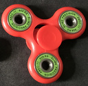
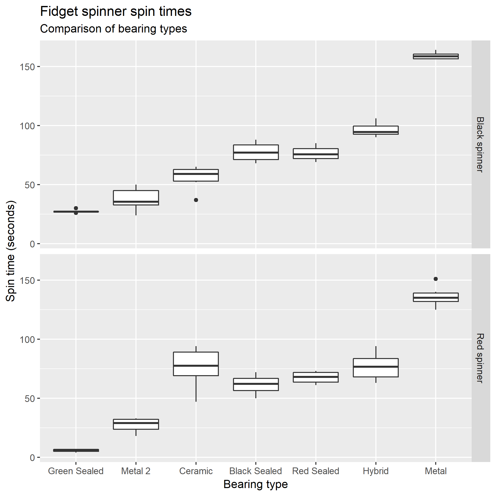
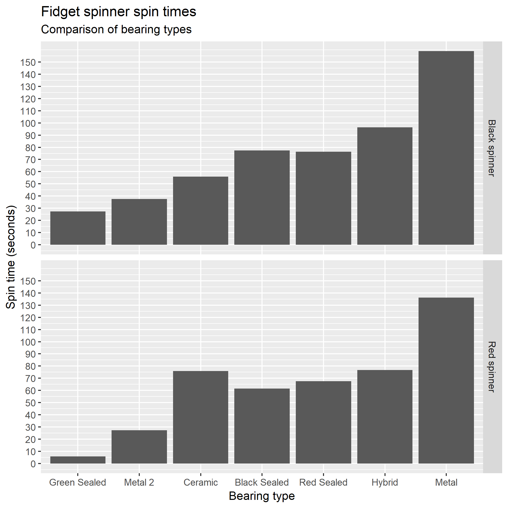
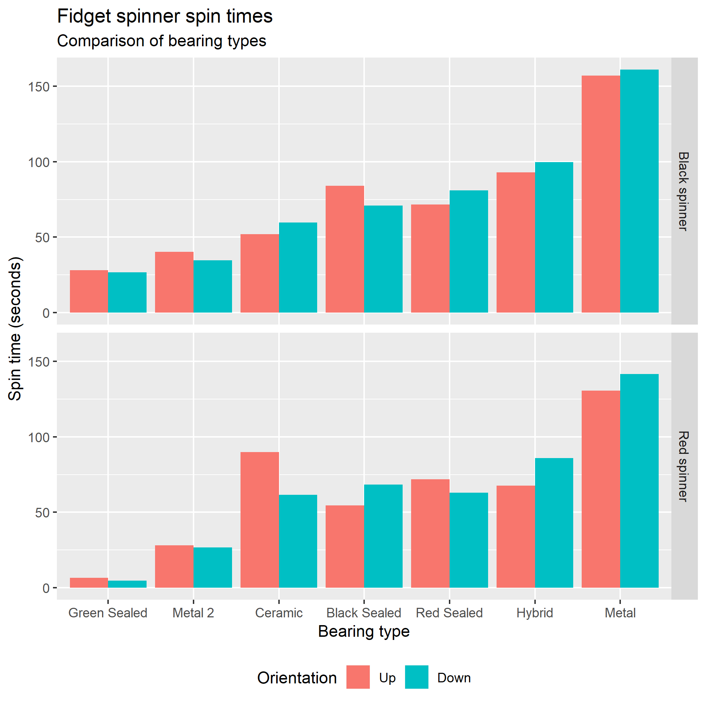

# Fidget Spinner Dataset

This dataset includes the spin times of two fidget spinners with various bearings. With 84 individual fidget spinner spin-times. Each spinner is tested with 7 bearings, each spun 6 times, each spin is clockwise but after 3 spins the spinner is flipped over. 

No particular effort was made to standardise the force of each spin, simply I try to spin it as hard as possible.

The CSV file contains the raw data, see bearing below to understand which bearings relate to which letter, top is binary and tells you which way up the spinner was. There is no particular reason for a side being considered "1" or "0" but for each bearing and spinner it was consistent. Time is in seconds.

### Spinners

#### Red spinner (r)


This spinner is weighed down with 3 green bearings in each arm of it's triarm design.

#### Black spinner (b)

Image of black spinner coming soon! This black plastic spinner has 3 metal weights to add momentum. One in each arm of it's triarm design.

### Bearings

#### Metal (m)
")
A basic metal bearing with 7 ball bearings on a metal rail, the default bearing that came with the spinner.

#### Metal2 (m2)
")
A basic metal bearing with 7 balls on a metal rail, a cheap bearing intended for basic skateboards.

#### Red Sealed (r)
")
A cheap red sealed bearing, intended for use with skateboards. Likely metal ball bearings on a metal rail. Marked "Freesport" and "speedballs".

#### Black Sealed (b)
")
A cheap black sealed bearing, intended for use with skateboards. Likely metal ball bearings on a metal rail. Marked ABEC-7.

#### Ceramic (c)
")
A white ceramic bearing with 7 white ceramic ball bearings on a white ceramic rail.

#### Hybrid (h)
")
A hybrid ceramic - metal bearing with 7 white ceramic ball bearings and a metal rail.

#### Green Sealed (g)
")
A very quite sealed bearing, likely metal on metal with a lot of lubrication. Marked "Slime precision" and ABEC-11.
It is also used as weights in the arms of the spinner to add momentum.

#### Results


```R
spinner.labels <- c(r = "Red spinner", b = "Black spinner")
ggplot(df, aes(reorder(bearing, time), time)) + 
    geom_boxplot() + 
    facet_grid(spinner~., labeller = labeller(spinner = spinner.labels)) +
    labs(x = "Bearing type", 
         y = "Spin time (seconds)", 
         title = "Fidget spinner spin times",
         subtitle = "Comparison of bearing types") + 
    scale_x_discrete(breaks=c("c", "m", "h", "r", "b", "m2", "g"), 
                     labels=c("Ceramic", "Metal", "Hybrid", "Red Sealed", "Black Sealed", "Metal 2", "Green Sealed")) +
    #geom_point(aes(colour=factor(top)), size=0.8) +
    theme(legend.position = "none")
```


```R
spinner.labels <- c(r = "Red spinner", b = "Black spinner")
ggplot(df, aes(reorder(bearing, time), time)) + 
    geom_bar(stat="summary") + 
    facet_grid(spinner~., labeller = labeller(spinner = spinner.labels)) +
    scale_x_discrete(breaks=c("c", "m", "h", "r", "b", "m2", "g"), 
                     labels=c("Ceramic", "Metal", "Hybrid", "Red Sealed", "Black Sealed", "Metal 2", "Green Sealed")) +
    scale_y_continuous(breaks=seq(0, 150, 10)) +
    labs(x = "Bearing type",
         y = "Spin time (seconds)", 
         title = "Fidget spinner spin times",
         subtitle = "Comparison of bearing types")
```


```R
spinner.labels <- c(r = "Red spinner", b = "Black spinner")
ggplot(df, aes(reorder(bearing, time), time, fill=factor(top))) + 
    geom_bar(position = "dodge", stat="summary") + 
    facet_grid(spinner~., labeller = labeller(spinner = spinner.labels)) +
    scale_x_discrete(breaks=c("c", "m", "h", "r", "b", "m2", "g"), 
                     labels=c("Ceramic", "Metal", "Hybrid", "Red Sealed", "Black Sealed", "Metal 2", "Green Sealed")) +
    scale_fill_discrete(labels=c("Up", "Down")) +
    labs(x = "Bearing type",
         y = "Spin time (seconds)",
         fill = "Orientation", 
         title = "Fidget spinner spin times",
         subtitle = "Comparison of bearing types") + 
    theme(legend.position = "bottom")
```
